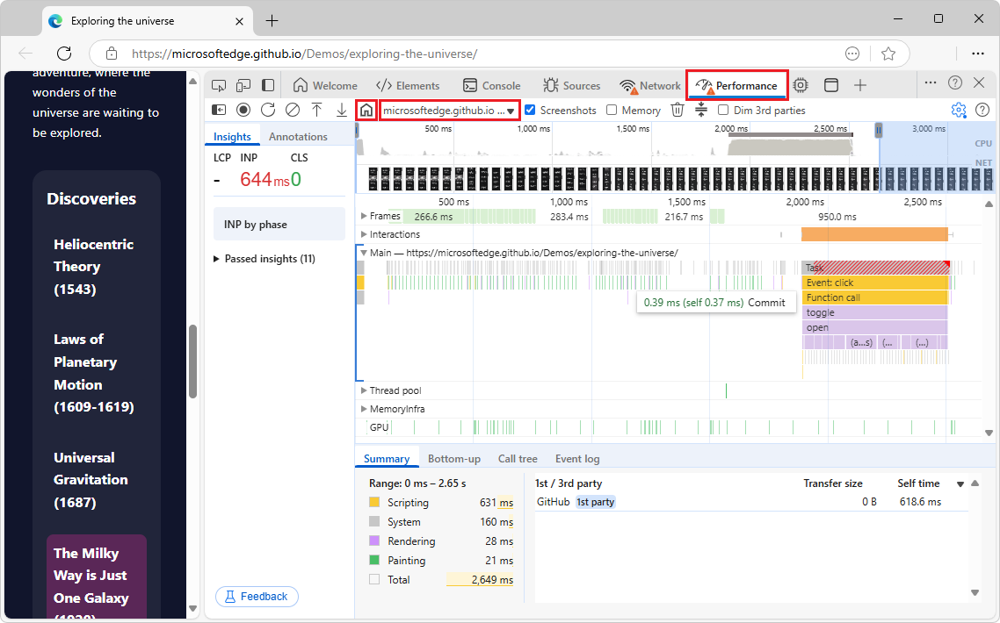
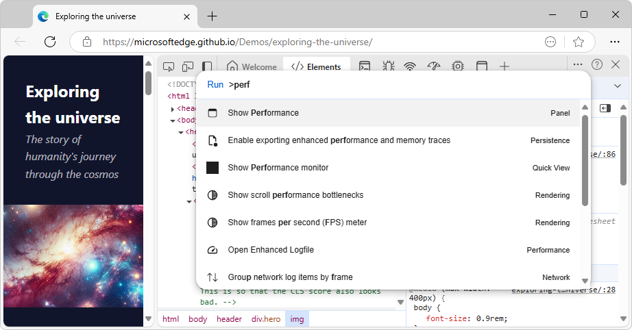

<!-- Copyright Dale St. Marthe and Sofia Emelianova

   Licensed under the Apache License, Version 2.0 (the "License");
   you may not use this file except in compliance with the License.
   You may obtain a copy of the License at

       https://www.apache.org/licenses/LICENSE-2.0

   Unless required by applicable law or agreed to in writing, software
   distributed under the License is distributed on an "AS IS" BASIS,
   WITHOUT WARRANTIES OR CONDITIONS OF ANY KIND, either express or implied.
   See the License for the specific language governing permissions and
   limitations under the License.  -->
# Performance tool: Analyze your website's performance
<!-- https://developer.chrome.com/docs/devtools/performance/overview -->
<!-- https://microsoftedge.github.io/Demos/exploring-the-universe/ -->

Use the **Performance** tool to analyze your website's performance.  There are two main views:

* The home page shows local metrics as you interact with the current webpage.
* Record a profile and view a performance timeline.

**Detailed contents:**
* [Overview](#overview)
   * [Local metrics for page interactions](#local-metrics-for-page-interactions)
   * [Recorded profile timeline](#recorded-profile-timeline)
   * [Switching to viewing local metrics or another profile](#switching-to-viewing-local-metrics-or-another-profile)
* [Open the Performance tool](#open-the-performance-tool)
   * [Using the Command Menu](#using-the-command-menu)
* [Monitor Core Web Vitals metrics](#monitor-core-web-vitals-metrics)
   * [Terminology](#terminology)
   * [Use the demo page](#use-the-demo-page)
   * [Interaction to Next Paint (INP)](#interaction-to-next-paint-inp)
   * [Interactions tab](#interactions-tab)
   * [Layout shifts tab](#layout-shifts-tab)
   * [View local and field metrics](#view-local-and-field-metrics)
   * [Simulate a real user environment](#simulate-a-real-user-environment)
* [Capture and analyze a performance report](#capture-and-analyze-a-performance-report)
   * [Record a performance profile](#record-a-performance-profile)
   * [Change capture settings](#change-capture-settings)
   * [Analyze a performance report](#analyze-a-performance-report)
* [Improve performance with these tools](#improve-performance-with-these-tools) -->

For a walkthrough of using the **Performance** tool to improve your website's performance, see [Analyze runtime performance (tutorial)](./index.md).

<!-- ====================================================================== -->
## Overview
<!-- https://developer.chrome.com/docs/devtools/performance/overview#overview -->
<!-- https://microsoftedge.github.io/Demos/exploring-the-universe/ -->
<!-- covers basic nav between the two states, and what to use them for, not how to use either view -->

The **Performance** tool displays local metrics for page interactions, and lets you record CPU performance profiles of your web applications.  Analyze profiles to find potential performance bottlenecks and ways that you can optimize resource use.

<!-- ------------------------------ -->
#### Local metrics for page interactions

Use the **Performance** tool to view Core Web Vitals metrics in the initial, **Local metrics** view.  The home page of the **Performance** tool shows **Local metrics**, which is performance metrics about the rendered webpage:

* Largest Contentful Paint (LCP) - How quickly the main content of the page loaded.
* Cumulative Layout Shift (CLS) - A measure of the most recent unexpected page layout shift.
* Interaction to Next Paint (INP) - The responsiveness of the most recent user interaction on the page.

When you initially open the **Performance** tool, Core Web Vitals metrics are displayed, in three cards in a **Local metrics** section:

<!-- do not reuse -->

<!-- ------------------------------ -->
#### Recorded profile timeline

Also use the **Performance** tool to view a recorded performance trace, including: 
* Record a performance profile.
* Change capture settings.
* Analyze a performance report.  Shows information about the performance of the page over the period of time where the recording occurred, such as:
   * The user interactions that occurred during the recording.
   * The JavaScript code that ran.
   * The styling and layout operations that occurred.
   * Other performance metrics over time, such as network requests and layout shifts.

After you record a performance trace, the performance trace is displayed instead of **Local metrics**.  

<!-- ------------------------------ -->
#### Switching to viewing local metrics or another profile

To switch to displaying the initial, **Local metrics** view, click the **Go back to the live metrics page** () button.

To switch to displaying a different opened recorded profile timeline,  click the **Show recent timeline sessions** dropdown, to the right of the **Go back to the live metrics page** () button.

<!-- do not reuse -->

<!-- ====================================================================== -->
## Open the Performance tool
<!-- https://developer.chrome.com/docs/devtools/performance/overview#open_the_performance_panel -->

To open the **Performance** tool: 

1. Go to a webpage, such as the [Exploring the universe](https://microsoftedge.github.io/Demos/exploring-the-universe/) demo, in a new window or tab.

1. Right-click the webpage, and then select **Inspect**.

   DevTools opens.

1. In the **Activity Bar** at top, click the  **Performance** tool.

   If the  **Performance** tool isn't shown in the **Activity Bar**, click the **More tools** () button and then select the **Performance** tool.

<!-- ------------------------------ -->
#### Using the Command Menu
<!-- added heading as separator, compared to upstream -->

To open the **Performance** tool by using the **Command Menu**:

1. Go to a webpage, such as the [Exploring the universe](https://microsoftedge.github.io/Demos/exploring-the-universe/) demo, in a new window or tab.

1. Right-click the webpage, and then select **Inspect**.

   DevTools opens.

1. In the upper right of DevTools, click **Customize and control DevTools**, click **Run command**.

   Or, press:

   * macOS: **Command+Shift+P**
   * Windows, Linux, ChromeOS: **Control+Shift+P**

   The **Command Menu** opens, and reads **Run >Command**.

1. Start typing **performance**, select **Show Performance [panel]**, and then press **Enter**.

   

<!-- ====================================================================== -->
## Monitor Core Web Vitals metrics
<!-- ## Observe Core Web Vitals live  https://developer.chrome.com/docs/devtools/performance/overview#live-metrics -->

The [Exploring the universe](https://microsoftedge.github.io/Demos/exploring-the-universe/) demo page is designed to load and handle interactions slowly on purpose, in order to illustrate how the LCP, CLS, and INP metrics can be used in the **Performance** tool to identify and fix performance issues.

Use the **Performance** tool to view Core Web Vitals metrics in the initial, **Local metrics** view.  The home page of the **Performance** tool shows **Local metrics**, which are performance metrics about the rendered webpage:

* **Largest Contentful Paint (LCP)** - How quickly the main content of the page loaded.
* **Cumulative Layout Shift (CLS)** - A measure of the most recent unexpected page layout shift.
* **Interaction to Next Paint (INP)** - The responsiveness of the most recent user interaction on the page.

<!-- ---------------------------------- -->
#### Terminology

| Term | Description | Docs |
|---|---|---|
| Web Vitals | A large set of metrics giving unified guidance to delivering a great user experience on the web. | [Web Vitals](https://web.dev/articles/vitals) |
| Core Web Vitals | The subset of Web Vitals that apply to all web pages, and should be measured by all site owners.  Each of the Core Web Vitals represents a distinct facet of the user experience, is measurable in the field, and reflects the real-world experience of a critical user-centric outcome. | [Core Web Vitals](https://web.dev/articles/vitals#core-web-vitals) in _Web Vitals_ |
| Largest Contentful Paint (LCP) | Measures _loading_ performance. To provide a good user experience, LCP should occur within 2.5 seconds of when the page first starts loading.  The render time of the largest image, text block, or video visible in the viewport, relative to when the user first navigated to the page. | [Largest Contentful Paint (LCP)](https://web.dev/articles/lcp), [Optimize LCP](https://web.dev/articles/optimize-lcp) |
| Cumulative Layout Shift (CLS) | Measures _visual stability_. To provide a good user experience, pages should maintain a CLS of 0.1. or less.  The largest burst of layout shift scores for every unexpected layout shift that occurs during the entire lifecycle of a page. | [Cumulative Layout Shift (CLS)](https://web.dev/articles/cls), [Optimize CLS](https://web.dev/articles/optimize-cls) |
| Interaction to Next Paint (INP) | Measures _interactivity_. To provide a good user experience, pages should have a INP of 200 milliseconds or less.  The page's overall responsiveness to user interactions, based on the latency of all click, tap, and keyboard interactions that occur throughout the lifespan of a user's visit to a page. | [Interaction to Next Paint (INP)](https://web.dev/articles/inp), [Optimize INP](https://web.dev/articles/optimize-inp) |
| local metrics, local data | The LCP, CLS, and INP metrics.  They are captured locally on the inspected webpage, and are updated as you interact with the page. | |

<!-- ---------------------------------- -->
#### Use the demo page

To produce a **poor** or **needs improvement** metric on the **LCP**, **CLS**, and **INP** cards in the **Performance** tool:

1. Open a webpage, such as the [Exploring the universe](https://microsoftedge.github.io/Demos/exploring-the-universe/) demo, in a new window or tab.

1. Right-click the webpage and then select **Inspect**.

   DevTools opens.

1. In the **Activity Bar** at top, select the  **Performance** tool.

   If the  **Performance** tool isn't shown in the **Activity Bar**, click the **More tools** () button and then select the **Performance** tool.

1. Maximize the window, and make the demo page pane wide, such as 60% of the width of the window.

   If the demo page pane is too narrow, some cards might continue showing **good**, with a green value, which is not the intended result.

1. Select **Next steps** pane > **Environment settings** card > **CPU throttling** dropdown > select **4x slowdown - recommended**.

   Or, select **Capture settings** () > **CPU throttling** dropdown > **4x slowdown - recommended**.

1. Select **Next steps** pane > **Environment settings** card > **Network throttling** dropdown > select **Slow 4G**.

1. Select **Next steps** pane > **Environment settings** card > select the **Disable network cache** checkbox.

   

1. Right-click (or long-click) the **Refresh** button to the left of the **Address bar**, and then select **Empty cache and hard refresh**.

   This ensures that the image is loaded again from the server, rather than from the local cache.

   The **LCP** and **CLS** cards show an orange value and **needs improvement**, or a red value and **poor**, instead of a green value and **good**.

1. If the **LCP** or **CLS** card remains green and says **good** after the galaxy image finishes rendering, maximize the window and make the demo page pane wider.

   The **LCP** card shows that the galaxy image took a long time to load.  The card shows an orange value and **needs improvement**, or a red value and **poor**, instead of a green value and **good**.  The engine identifies this image as the largest item to be rendered.

1. In the **LCP** card, hover over the metric value to see information in a tooltip.

   The **CLS** card illustrates that sudden, unexpected jumps in the layout can negatively impact users.  This is also due to the image taking some time to load.  By design, the demo webpage neglects to specify a height for the image, and so the page initially loads without reserving much space for the image.  When the image starts appearing, the content below it suddenly jumps down.

1. In the **CLS** card, hover over the metric value to see information in a tooltip.

1. After the galaxy image finishes rendering, in the rendered demo page, click one of the headings in the right-hand **Discoveries** column, such as **Heliocentric Theory (1543)**.

   The **INP** card changes from not showing a value, to showing an orange value and **needs improvement**, or a red value and **poor**.  An **INP** value is displayed.

1. In the **INP** card, hover over the metric value to see information in a tooltip.

1. In the **INP** card, click the INP value.

   In the demo page, the **Discoveries** cards are designed to expand and re-render slowly, so that it takes a long time between clicking the heading and rendering the expanded card content.  The delay is a random value between 100ms and 1000ms, resulting in a high INP value.

   Below the **Local metrics** cards, the **Interactions** tab and **Layout shifts** tabs are populated.

<!-- ------------------------------ -->
#### Interactions tab

The **Interactions** tab displays information about your interactions with the webpage:

The **Interactions** tab includes:
* Phases.
* Elements.
* Timings.

To clear the **Interactions** tab, click the **Clear the current log** () button to the right of the **Interactions** tab.

<!-- ------------------------------ -->
#### Layout shifts tab

The **Layout shifts** tab displays information about layout shifts:

The **Layout shifts** tab includes:
* Scores.
* Elements.

<!-- ------------------------------ -->
<!-- #### Compare your experience to the experience of your users -->
<!-- https://developer.chrome.com/docs/devtools/performance/overview#compare -->

<!-- ------------------------------ -->
<!-- #### Configure your environment to better match that of your users -->
<!-- https://developer.chrome.com/docs/devtools/performance/overview#env-config -->

<!-- ====================================================================== -->
## Capture and analyze a performance report
<!-- https://developer.chrome.com/docs/devtools/performance/overview#capture_and_analyze_a_performance_report -->

In the next sections, follow guidance on how to record a profile, change capture settings, and analyze the report.

<!-- ------------------------------ -->
#### Record a performance profile
<!-- https://developer.chrome.com/docs/devtools/performance/overview#record_a_performance_profile -->

When you are ready to record, the **Performance** tool gives you the following options:

* [Record runtime performance](./reference.md#record-runtime-performance) in _Performance features reference_.
* [Record load performance](./reference.md#record-load-performance) in _Performance features reference_.
* [Capture screenshots while recording](./reference.md#capture-screenshots-while-recording) in _Performance features reference_.
* [Force garbage collection while recording](./reference.md#force-garbage-collection-while-recording) in _Performance features reference_.
* [Save and share a recording](./reference.md#save-and-share-a-recording) in _Performance features reference_.
* [Load a recording](./reference.md#load-a-recording) in _Performance features reference_.
* [Clear the previous recording](./reference.md#clear-the-previous-recording) in _Performance features reference_.

<!-- ------------------------------ -->
#### Change capture settings
<!-- https://developer.chrome.com/docs/devtools/performance/overview#change_capture_settings -->

**Capture settings** let you change how DevTools captures performance recordings and can give you additional information in the report.  Click the **Capture settings** () button to access the **Capture settings** menu.

Select the following options from the **Capture settings** menu:

* Select the **Disable JavaScript samples** checkbox:  Disables the recording of the JavaScript call stacks displayed in the Main track that are called during the recording.  Reduces performance overhead.  See [Disable JavaScript samples](../performance/reference.md#disable-javascript-samples) in _Performance features reference_.

* Select the **Enable advanced rendering instrumentation (slow)** checkbox:  Captures advanced paint instrumentation.  Significantly hinders performance.  See [Enable advanced paint instrumentation](../performance/reference.md#enable-advanced-paint-instrumentation) in _Performance features reference_.

* Select the **Enable CSS selector stats (slow)** checkbox: Captures CSS selector statistics.  Significantly hinders performance.  See [View CSS selector costs in the Performance tool sidebar](../whats-new/2024/11/devtools-131.md#view-css-selector-costs-in-the-performance-tool-sidebar) in _What's New in DevTools (Microsoft Edge 131)_.

* CPU throttling: Simulate slower CPU speeds.  See [Throttle the CPU while recording](../performance/reference.md#throttle-the-cpu-while-recording) in _Performance features reference_.  

* Network throttling: Simulate slower network speeds.  See [Throttle the network while recording](../performance/reference.md#throttle-the-network-while-recording) in _Performance features reference_.

<!-- ------------------------------ -->
#### Analyze a performance report
<!-- https://developer.chrome.com/docs/devtools/performance/overview#analyze_a_performance_report -->

For a complete guide on how to use the **Performance** tool, see [Analyze a performance recording](../performance/reference.md#analyze-a-performance-recording) in _Performance features reference_.

To navigate a performance report:

* See [Navigate the recording](../performance/reference.md#navigate-the-recording) in _Performance features reference_.

* See [Search activities](../performance/reference.md#search-activities) in _Performance features reference_.

* See [Track event initiators](../performance/reference.md#track-event-initiators) in _Performance features reference_.

To focus on what matters for your workflow:

* [Change the order of tracks and hide them](../performance/reference.md#change-the-order-of-tracks-and-hide-them)

* [Hide functions and their children in the flame chart](../performance/reference.md#hide-functions-and-their-children-in-the-flame-chart)

* [Zoom on portions of a recording and switch between zoom levels](./reference.md#zoom-on-portions-of-a-recording-and-switch-between-zoom-levels) in _Performance features reference_.

To learn about the **Bottom-up**, **Call tree**, and **Event log** tabs:

* [View activities in a table](./reference.md#view-activities-in-a-table) in _Performance features reference_.

To analyze a performance report:

* [View main thread activity](./reference.md#view-main-thread-activity) in _Performance features reference_.
* [Read the flame chart](./reference.md#read-the-flame-chart) in _Performance features reference_.
* [View a screenshot](./reference.md#view-a-screenshot) in _Performance features reference_.
* [View memory metrics](./reference.md#view-memory-metrics) in _Performance features reference_.
* [View the duration of a portion of a recording](./reference.md#view-the-duration-of-a-portion-of-a-recording) in _Performance features reference_.
* [Analyze CSS selector performance during Recalculate Style events](./selector-stats.md).
* [Analyze frames per second (FPS)](./reference.md#analyze-frames-per-second-fps) in _Performance features reference_.
* [Performance recording event reference](./performance-reference.md)

<!-- ====================================================================== -->
## Improve performance with these tools

Discover other tools that can help you improve your website's performance:

| Tool | Article |
|---|---|
| **Lighthouse** tool | [Optimize website speed using Lighthouse](../speed/get-started.md) |
| **Memory** tool | [Fix memory problems](../memory-problems/index.md) |
| **Performance** tool > **Insights** tab | [Get actionable insights](./reference.md#get-actionable-insights) in _Performance features reference_. |
| **Rendering** tool | [Rendering tool, to see what a webpage looks like with different display options or vision deficiencies](../rendering-tools/rendering-tool.md) |
| **Issues** tool | [Find and fix problems using the Issues tool](../issues/index.md) |
| **Performance** tool | [View layers information](../performance/reference.md#view-layers-information) in _Performance features reference_ |

<!-- ====================================================================== -->
> [!NOTE]
> Portions of this page are modifications based on work created and [shared by Google](https://developers.google.com/terms/site-policies) and used according to terms described in the [Creative Commons Attribution 4.0 International License](https://creativecommons.org/licenses/by/4.0). 
> The original page is found [here](https://developer.chrome.com/docs/devtools/performance/overview) and is authored by Dale St. Marthe and Sofia Emelianova.

This work is licensed under a [Creative Commons Attribution 4.0 International License](https://creativecommons.org/licenses/by/4.0).
