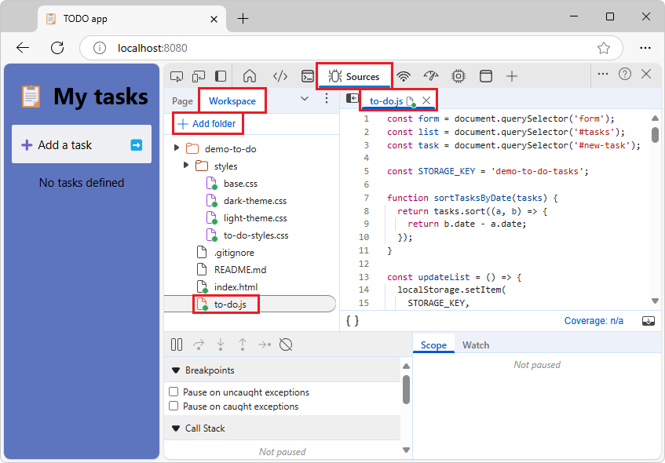

# Display or edit source files using the Quick source tool
<!-- the present file & upstream are written independently https://developer.chrome.com/docs/devtools/quick-source -->

Use the **Quick source** tool to display or edit source files when using a tool other than the **Sources** tool.

The main place to view source files in the DevTools is within the **Sources** tool.  But sometimes you need to access other tools, such as **Elements** or **Console**, while viewing or editing your source files.  Use the **Quick source** tool, which by default opens in the **Quick View** panel at the bottom of DevTools.

If you open **Quick source** tool without first selecting a file in the **Sources** tool, the **Quick source** tool doesn't have any files:

<!-- ====================================================================== -->
## Open a file in the Quick source tool

In this approach, we'll open the **Quick source** tool before selecting any files in the **Sources** tool, so the **Quick source** tool initially won't display any files.

To open a file in the **Quick source** tool:

1. Open a webpage; for example, open [Demo To Do](https://microsoftedge.github.io/Demos/demo-to-do/) in a new window or page.

1. Right-click the webpage and then select **Inspect**.

   DevTools opens.

1. If the **Quick View** toolbar isn't shown at the bottom of DevTools, press **Esc**.

1. In the **Quick View** toolbar at the bottom of DevTools, click the **More tools** button, and then select **Quick source**.

   The **Quick source** tool opens in **Quick View**:

   

   No files are displayed, because no files are selected in the **Sources** tool.

1. In the **Activity Bar**, select the **Sources** () tool.

   The **Quick View** pane is minimized at the bottom of DevTools.

1. In the **Page** tab (or the **Workspace** tab), select one or more files, such as `to-do.js`.

   The tabs for the selected files are opened in the **Sources** tool:

   

1. In the **Activity Bar**, select a tool other than **Sources**, such as **Elements**.

   The **Quick source** tool expands in **Quick View** at the bottom of DevTools, and has a tab for each open file:

   

<!-- ====================================================================== -->
## Open a folder and sync workspace

To open a file in the **Quick source** tool and sync edits to the workspace:

1. Open a webpage; for example, open [Demo To Do](https://microsoftedge.github.io/Demos/demo-to-do/) in a new window or page.

1. Right-click the webpage and then select **Inspect**.

   DevTools opens.

1. If the **Quick View** toolbar isn't shown at the bottom of DevTools, press **Esc**.

1. In the **Quick View** toolbar at the bottom of DevTools, click the **More tools** button, and then select **Quick source**.

   The **Quick source** tool opens in **Quick View**:

   

   No files are displayed, because no files are selected in the **Sources** (bug icon) tool.

1. In the **Quick source** tool, click the **Select folder** link.  (Or, drag a folder onto the **Quick source** panel.)

   The **Select Folder** dialog opens.

1. Navigate to a folder, such as `C:\Users\localAccount\GitHub\Demos\demo-to-do`, and then click the **Select Folder** button.

   At the top of DevTools, a message reads **DevTools requests full access to \<path\>**.

1. Click the **Allow** button.

   The **Sources** tool is opened, with no file selected, and continues to display a **Select folder** link.

1. In the **Sources** tool, select the **Workspace** tab (or the **Page** tab).

1. Expand the tree, and then click one or more files, such as `to-do.js`.

   The file opens in the **Sources** tool:

   

1. In the **Activity Bar** at top of DevTools, select a tool other than the **Sources** tool, such as the **Elements** tool.

   The **Quick source** tool expands in **Quick View** at the bottom of DevTools, and has a tab for each open file:

   

<!-- ====================================================================== -->
## See also:

* [Displaying source files when using a different tool](../sources/index.md#displaying-source-files-when-using-a-different-tool) in _Sources tool overview_
* [Step 4: Save a JavaScript change to disk](../workspaces/index.md#edit-javascript-and-save-changes-to-the-source-file) in _Edit files with Workspaces (Filesystem tab)_
