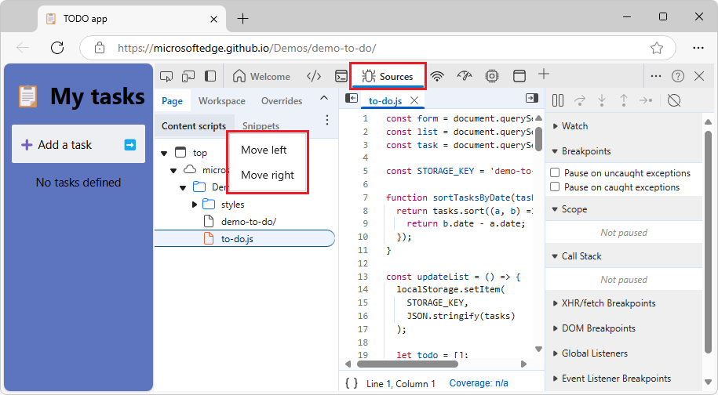
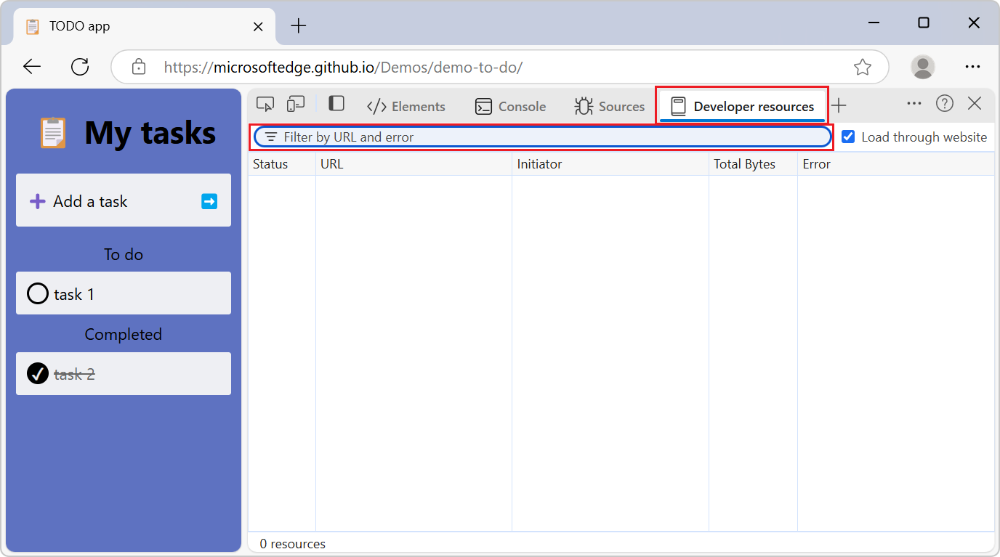
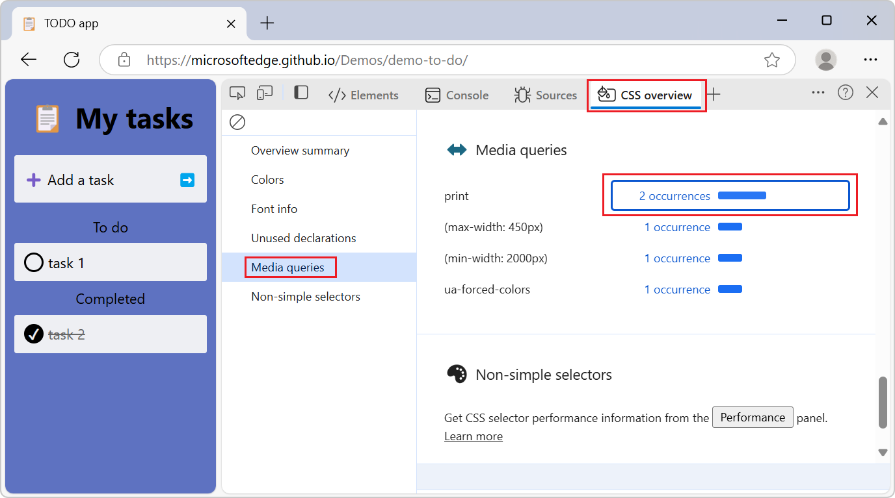

# What's New in DevTools (Microsoft Edge 133)

To check out the latest features of Microsoft Edge DevTools<!-- and the Microsoft Edge DevTools extension for Microsoft Visual Studio Code and Visual Studio -->, read these announcements.

<!-- ====================================================================== -->
## Move a tab left or right within the Elements or Sources tool

<!-- Subtitle: Move a tab left or right within a tab group in the Elements or Sources tool by right-clicking the tab. -->

Previously, within the **Elements** tool and **Sources** tool, you could rearrange the tabs within a tab group only by dragging them.  Dragging a tab can be difficult when using a trackball, head pointer, or keyboard.  Now, you can also move a tab by right-clicking the tab (or pressing the **Context menu** key) and then selecting **Move left** or **Move right**.

Right-clicking a tab within the **Elements** tool:

Right-clicking a tab within the **Sources** tool:

<!-- ====================================================================== -->
## Screen reader support improvements

<!-- Subtitle: Screen reader support improvements in Developer resources, Elements, and CSS overview.-->

Support for screen readers has been improved for various tools.

<!-- ------------------------------ -->
#### Developer resources tool

In the **Developer resources** tool, after you search by using the **Filter by URL and error** text box, screen readers announce the results information.  If no results are available, screen readers announce "No resource matches":

<!-- ------------------------------ -->
#### Elements tool

In the **Elements** tool, screen readers announce the expanded or collapsed state of the **More tabs** button and tab group, shown here in the expanded state:

<!-- ------------------------------ -->
#### CSS overview tool

In the **CSS overview** tool, when navigating to a tab, screen readers announce the tab label.  After entering that tab and then navigating to an **occurrences** button, screen readers announce the button's label, such as "Two occurrences":

<!-- ====================================================================== -->
## Announcements from the Chromium project

Microsoft Edge 133 also includes the following updates from the Chromium project:

* [Performance panel improvements](https://developer.chrome.com/blog/new-in-devtools-133#perf)
   * [Image delivery insight](https://developer.chrome.com/blog/new-in-devtools-133#perf-image-delivery)
   * [Classic and modern keyboard navigation](https://developer.chrome.com/blog/new-in-devtools-133#perf-nav)
   * [Ignore irrelevant scripts in the flame chart](https://developer.chrome.com/blog/new-in-devtools-133#ignore-list)
   * [Timeline marker and range highlighting on hover](https://developer.chrome.com/blog/new-in-devtools-133#hover-highlight)
   * [Recommended throttling settings](https://developer.chrome.com/blog/new-in-devtools-133#throttling)
   * [Timings markers in an overlay](https://developer.chrome.com/blog/new-in-devtools-133#markers)
   * [Stack traces of JavaScript calls in Summary](https://developer.chrome.com/blog/new-in-devtools-133#perf-stack-traces)
* [Badge settings moved to menu in Elements](https://developer.chrome.com/blog/new-in-devtools-133#badge-settings)

<!-- ====================================================================== -->
## Download the preview channels

To stay up to date and get the latest DevTools features, download an Insiders preview version of Microsoft Edge.  Whether you're on Windows, Linux, or macOS, consider using Canary (or another preview channel) as your default development browser.

The Beta, Dev, and Canary versions of Microsoft Edge run as separate apps, side-by-side with the stable, released version of Microsoft Edge.  See [Microsoft Edge Insider Channels](https://aka.ms/microsoftedge).

<!-- ====================================================================== -->
## Get in touch with the Microsoft Edge DevTools team

For the latest announcements, [follow the Microsoft Edge team on Twitter](https://twitter.com/MSEdgeDev).

To report a problem with DevTools or ask for a new feature, file an issue in the [MicrosoftEdge/DevTools](https://github.com/MicrosoftEdge/DevTools) repo.

<!-- ====================================================================== -->
## See also

* [Release Notes for web platform for Microsoft Edge](../../../../web-platform/release-notes/index.md)
