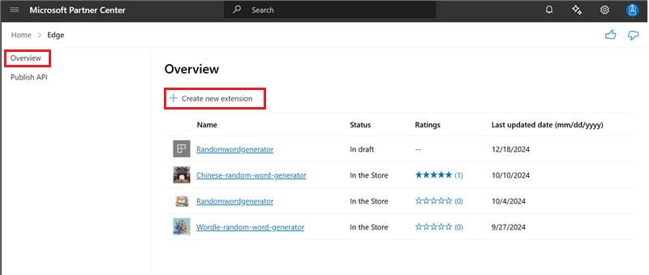
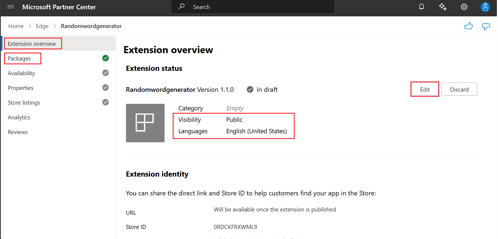
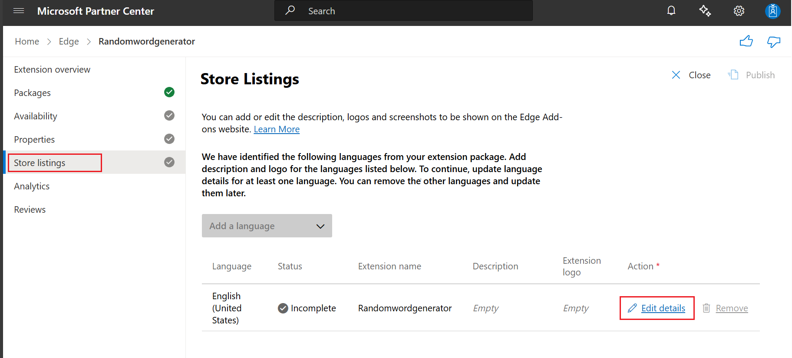
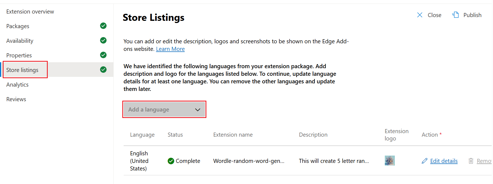
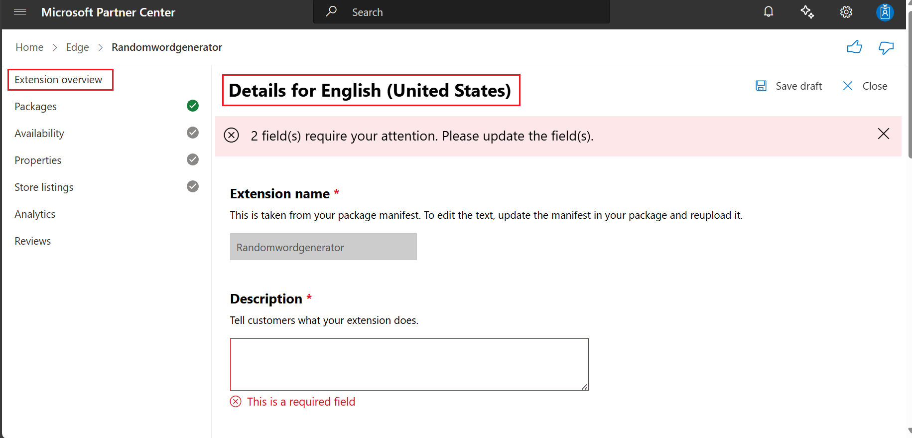
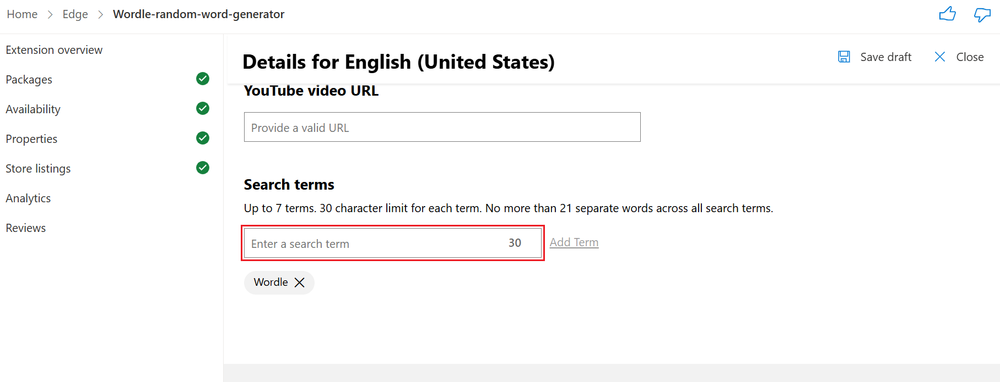
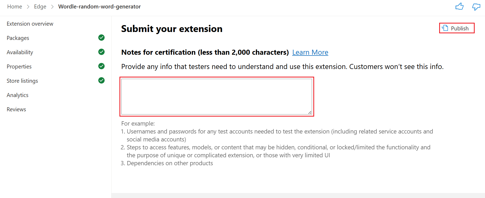

# Publish a Microsoft Edge extension

After you develop and test your Microsoft Edge extension, you're ready to distribute your extension at [Microsoft Edge Add-ons](https://microsoftedge.microsoft.com/addons/).  To release your existing Chromium extension for Microsoft Edge users, see [Port a Chrome extension to Microsoft Edge](../developer-guide/port-chrome-extension.md).

Publish your extension at [Microsoft Edge Add-ons](https://microsoftedge.microsoft.com/addons/) to increase its reach and make it available to other Microsoft Edge users.  This article provides the process to submit your extension at [Microsoft Edge Add-ons](https://microsoftedge.microsoft.com/addons/).

<!-- ========================================================================== -->
## Prepare an extension to be submitted via Partner Center

To prepare an extension to be submitted via Partner Center, to be published at [Microsoft Edge Add-ons](https://microsoftedge.microsoft.com/addons/), do the following steps.

<!-- ---------------------------------- -->
#### Have a working prototype of your extension

Before publishing your extension, you should have a working prototype of your extension ready.  For information on how to create an extension, see [Extension concepts and architecture](../getting-started/index.md).

<!-- ---------------------------------- -->
#### Create a developer account

To publish your extension at [Microsoft Edge Add-ons](https://microsoftedge.microsoft.com/addons/), use your active developer account on [Partner Center](https://partner.microsoft.com/dashboard/microsoftedge/public/login?ref=dd).  If you don't have a developer account, create a new developer account.  To open a new developer account and register to the Microsoft Edge Add-ons program, see [Developer registration](./create-dev-account.md).

<!-- ---------------------------------- -->
#### Create a zip file for your extension package

Create a zip file for your extension package.  Your extension package must include the following files:

* The extension manifest that specifies details such as the name of the extension, short description, permissions, and default language.

* Images and other files required by your extension.

<!-- ---------------------------------- -->
#### Review manifest field values

At Partner Center and in Microsoft Edge Add-ons articles, the word _store_ includes [Microsoft Edge Add-ons](https://microsoftedge.microsoft.com/addons/).

Before uploading your package to Partner Center, inspect the manifest file to make sure that the field values match your preferred display on the **Store<!-- todo: is 'store' ok in the UI? --> Listings** page, as follows.

The following fields in the manifest file are automatically included in your store<!-- todo: is 'store' ok in this article? --> listing details.  The fields are read-only on the **Store Listings** page, which is described below.

*  The `Name` field, which populates the **Display name** on the store details page.

*  The `Description` field, which populates the **Short description** on the store details page.
   
   Fill in the `Description` field, to explicitly provide a catchy description that will be displayed at the top of the listing for your extension.

   * If you include a `short description` in the extension manifest file, that short description is displayed in your store listing.

   * If you don't include a `short description` in the manifest file, the first few lines of the `Description` are displayed in your store listing.  We recommend providing a `short description`, to avoid content repetition on your store listing page.

Later, after you upload your package, you'll have an opportunity to modify some fields at Partner Center.

<!-- ========================================================================== -->
## Submit your extension at Microsoft Edge Add-ons

After doing the above steps, the extension is ready to be submitted via Partner Center, to be published at [Microsoft Edge Add-ons](https://microsoftedge.microsoft.com/addons/).

To submit your extension to Partner Center:

* [Step 1: Start a new submission](#step-1-start-a-new-submission).
* [Step 2: Upload the extension package](#step-2-upload-the-extension-package).
* [Step 3: Provide availability details](#step-3-provide-availability-details).
* [Step 4: Enter properties describing your extension](#step-4-enter-properties-describing-your-extension).
* [Step 5: Add store listing details for your extension](#step-5-add-store-listing-details-for-your-extension).
* [Step 6: Complete the submission by providing testing notes](#step-6-complete-the-submission-by-providing-testing-notes).

Details are below.

<!-- ========================================================================== -->
## Step 1: Start a new submission

1. Go to the [developer dashboard](https://partner.microsoft.com/dashboard/microsoftedge/public/login?ref=dd).

   The Partner Center **Overview** page opens:

   

1. Click **Create new extension**.

<!-- ========================================================================== -->
## Step 2: Upload the extension package

The **Extension overview** page shows information for a specific extension:

To upload the extension package:

1. On the left, click **Packages**.  The **Packages** page opens.

   You can only upload one package at a time. Your submission is blocked if the package upload isn't successful on the **Packages** page.

1. To upload your package, drag and drop the zip file to the **Drag your package here (.zip)** section of the page. Or you can select **Browse your files** to open a dialog to select the package to upload.

   After your package is uploaded, it's validated. If there's a validation error, resolve the issue and try uploading your package again.

1. When validation succeeds, review the extension details.

1. Click the **Continue** button.

   The **Availability** page opens.

<!-- ========================================================================== -->
## Step 3: Provide availability details

On the **Availability** page for the extension, fill in the **Visibility** and **Markets** sections as follows.

<!-- ------------------------------ -->
#### Visibility

Select one of the following visibility options to define whether your extension is discoverable at [Microsoft Edge Add-ons](https://microsoftedge.microsoft.com/addons/):

* `Public` (default) - Allows everyone to discover your extension through search, browsing at [Microsoft Edge Add-ons](https://microsoftedge.microsoft.com/addons/), or using the listing URL for your extension at [Microsoft Edge Add-ons](https://microsoftedge.microsoft.com/addons/).  The listing URL is available on your Partner Center dashboard on the Extension **Overview** page.

* `Hidden` - Removes an extension from search results or browsing at [Microsoft Edge Add-ons](https://microsoftedge.microsoft.com/addons/).  To distribute a hidden extension at [Microsoft Edge Add-ons](https://microsoftedge.microsoft.com/addons/), you must share the listing URL to the extension with your customers.

You can change the visibility of your extension from **Public** to **Hidden**.  Users who installed your extension while the visibility was set to **Public** retain access to your extension and receive any updates you make available at [Microsoft Edge Add-ons](https://microsoftedge.microsoft.com/addons/).

<!-- ------------------------------ -->
#### Markets

Define the specific markets in which you plan to offer your extension.  The default setting for markets is all markets and that includes any future markets that are added later.

1. To choose specific markets, click the **Change markets** button.

1. Toggle individual markets to exclude each one or select **Unselect all** and then add individual markets of your choice.

   You can change the markets where your extension is offered.  A user who installs your extension while it's available in the user's market retains access to your extension.  However, the user doesn't have access to any future updates that are submitted at [Microsoft Edge Add-ons](https://microsoftedge.microsoft.com/addons/).

1. Click the **Save & Continue** button.

   The **Properties** page opens.

<!-- ========================================================================== -->
## Step 4: Enter properties describing your extension

1. On the left, click **Properties**.

   The **Properties** page for the extension opens.

1. Enter the following information:

   | Property name | Required? | Description |
   |---|---|---|
   | **Category** | Required | The category that best describes your extension.  Listing your extension in the right category helps users find your extension easily and understand more about it.  |
   | **Privacy policy requirements** | Required | Indicate if your extension accesses, collects, or transmits any personal information.  Your extension might fail the certification step if you select **Yes** and you don't provide a `Privacy policy URL`. |
   | **Privacy policy URL** | - | A valid privacy policy URL to communicate how your extension follows privacy laws and regulations.  You're responsible for ensuring your extension follows privacy laws and regulations.  You're also responsible for providing a privacy policy URL if any personal information is being accessed, transmitted, or collected by your extension.  To determine if your extension requires a privacy policy, see [Microsoft Store App Developer Agreement](https://go.microsoft.com/fwlink/?linkid=528905) and [Developer policies for extensions at Microsoft Edge Add-ons](/legal/microsoft-edge/extensions/developer-policies). |
   | **Website URL** | - | A webpage that provides additional information about your extension.  The `Website URL` must point to a webpage on your own website, not the web listing for your extension at [Microsoft Edge Add-ons](https://microsoftedge.microsoft.com/addons/).  The `Website URL` helps users learn more about your extension, its features, and any other relevant information. |
   | **Support contact details** | - | The URL to your support webpage, or the email address to contact your support team. |
   | **Mature content** | - | Checkbox to specify if your extension includes mature content.  Extension rating helps determine the appropriate age group of the target audience of your extension.  To help determine if your extension has mature content, see [Developer policies for extensions at Microsoft Edge Add-ons](/legal/microsoft-edge/extensions/developer-policies). |
   
   Properties that are not indicated as Required are Optional.

   The properties are displayed to users at [Microsoft Edge Add-ons](https://microsoftedge.microsoft.com/addons/).  Your developer/organization name, **Website URL**, and **Support contact details** that you submitted during registration are displayed to users at [Microsoft Edge Add-ons](https://microsoftedge.microsoft.com/addons/).

1. Click the **Save & Continue** button.

   The **Store Listings** page opens.

<!-- ========================================================================== -->
## Step 5: Add store listing details for your extension

1. On the left, click **Store listings**.

   The **Store Listings** page opens:

   

1. Click the **Edit details** button.<!-- The **Details** page opens.  todo: confirm UI -->

1. In the **Language details** section, fill in the following properties:

   | Property name | Required? | Description |
   |---|---|---|
   | **Display name** | Required for at least one language | The `name` of your extension specified in the manifest file of your extension.  To change the store display name after submission, you can update the name in the manifest file, create a new extension package, and then re-upload it. |
   | **Description** | Required for each language | The `description` field explains what your extension does, why users should install it, and any other relevant information users need to know.   * **Length:** Minimum 250 characters, maximum 5000 characters.   * **Clarity:** Must clearly describe the full functionality of your extension.   * **Completeness:** Should be thorough and include all important details.   * **Appropriateness:** Must not contain any misleading or inappropriate content. |
   | **Extension Store logo** | Required for each language | An image that represents your company or `extension logo` with an aspect ratio of 1, and recommended size of 300 x 300 pixels.  You can copy the asset from one language to all other languages by using the **Duplicate** button, which is displayed next to this field after you upload your logo for the language. |
   | **Small promotional tile** | - | The `Small promotional tile` image is used to display your extension alongside other extensions in the store.  The size of the image should be 440 x 280 pixels.  You can copy the asset from one language to all other languages by using the **Duplicate** button.  The button is found following the field after you upload a promotional tile for the language. |
   | **Large promotional tile** | - | `Large promotion tiles` are used in the store to feature extensions more prominently at [Microsoft Edge Add-ons](https://microsoftedge.microsoft.com/addons/).  The images, if submitted, are visible to the users.  The size of the PNG files must be 1400 x 560 pixels.  You can copy the asset from one language to all other languages by using the **Duplicate** button.  The button is found following the field after you upload a promotional tile for the language. |
   | **Screenshots** | - | You can submit a maximum of 10 `screenshots` describing the functionality of your extension in detail.  The size of the screenshots must be either 640 x 480 pixels or 1280 x 800 pixels.  You can copy the asset from one language to all other languages by using the **Duplicate** button.  The button is found following the field after you upload at least one for the language. |
   | **YouTube video URL** | - | You can include a promotional YouTube video of your extension.  The `YouTube video URL` video is displayed on the store listing page of your extension. |
   | **Short description** | Required for at least one language | To edit the `short description`, you must update the description field in your manifest file of your extension package and reupload it. |
   | **Search terms** | - | `Search terms` are single words or phrases that help discover your extension when a user searches at [Microsoft Edge Add-ons](https://microsoftedge.microsoft.com/addons/).  The search terms aren't displayed to users. |

   The information provided in the **Store Listings** page is displayed to users who view your listing at [Microsoft Edge Add-ons](https://microsoftedge.microsoft.com/addons/).  Even though some fields are optional, you should provide as much information as possible.

<!-- 
1. Click **Save** in the upper right. todo: confirm UI
-->

<!-- ------------------------------ -->
#### Required properties

To list your extension in the store, properties that are not indicated as Required in the above table are Optional.

The following Required properties must be provided for _each_ language (such as U.S. English; `en-US`) that's listed in your extension zip package:
* **Description**
* **Extension Store logo**

The following Required properties must be filled in for _at least one_ of the languages that's listed in your extension zip package:
* **Display name**
* **Short description**

<!-- ------------------------------ -->
#### Supporting multiple languages

To support multiple languages, you can use the internationalization API ([chrome.i18n](https://go.microsoft.com/fwlink/?linkid=2167478)).

To add or remove languages in your store listing at [Microsoft Edge Add-ons](https://microsoftedge.microsoft.com/addons/), use the **Add a language** dropdown list on the **Store Listings** page:

You can duplicate your assets from one language across other languages by using the **Duplicate functionality** button on the **Language details** page.

<!-- ------------------------------ -->
#### YouTube video URL requirements

Fill in required fields in the **Details for English (United States)** page, scrolling down as needed:

If you are linking to a video, make sure your video meets the following requirements.

* Verify that the content of the YouTube video follows the [Developer policies for extensions at Microsoft Edge Add-ons](/legal/microsoft-edge/extensions/developer-policies).

* Turn off advertisements on your video.  For more information, see [YouTube advertising formats](https://support.google.com/youtube/answer/2467968?ref_topic=7072227) and [Ads on embedded videos](https://support.google.com/youtube/answer/132596).

To submit the YouTube video URL of your video:

1. On YouTube, locate the video that you want to add to your store listing page.

1. Under the video, click the **Share** button, and then click the **Copy** button to copy the URL for the video.

1. On the store listing details page, paste the URL in the **YouTube video URL** field:

   

<!-- ------------------------------ -->
#### Search terms requirements

1. In the **Details for English (United States)** page (or equivalent language/market page), in the **Search terms** text box, enter search terms:

   

   Search terms must meet the following requirements:

   * You can enter search terms to use up to a maximum of 21 words.  Whether used as single words, phrases, or a combination of both, you're only allowed a maximum of 21 words.

   * Up to a maximum of seven search terms (single word or phrases).  Each search term has a character limit of 30 characters.

1. Click the **Close** button.  

   The **Store listing** page reappears.

<!-- ========================================================================== -->
## Step 6: Complete the submission by providing testing notes

On the **Submit your extension** page, you can optionally add notes for certification to help test your extension.  When you submit your extension, use the **Notes for certification** text box to provide additional information to the certification testers.  The additional information helps ensure that your extension is tested correctly.  If your extension isn't fully tested, it might fail certification.

To add notes for certification:

1. Click the **Submit** button.

   The **Submit your extension** page opens:

   

1. Fill in the **Notes for certification** text box.

   You can compose and save your notes in a text editor, such as Visual Studio Code, and then paste the notes into the text box.  Include any needed information, such as:

   * Usernames and passwords for test accounts.

   * Steps to access hidden or locked features.

   * Expected differences in functionality based on region or other user settings.

   * If your submission is an update to an existing extension, include information about the changes made to the extension.

   * Any additional information that testers must understand about your submission.

1. Click the **Publish** button, in the upper right.

   Your extension is submitted at [Microsoft Edge Add-ons](https://microsoftedge.microsoft.com/addons/).

   Your submission then proceeds to the certification step.  The certification process can take up to seven business days after your submission.

   After your submission passes certification, your extension is published at [Microsoft Edge Add-ons](https://microsoftedge.microsoft.com/addons/).  The status of your extension in the Partner Center dashboard changes to **In the Store**.

<!-- ========================================================================== -->
## Support for issues

If you encounter any issues in the submission or registration process, file a support ticket on [Extensions New Support Request](https://support.microsoft.com/supportrequestform/e7a381be-9c9a-fafb-ed76-262bc93fd9e4) or send an email to [ext_dev_support@microsoft.com](mailto:ext_dev_support@microsoft.com).

<!-- ========================================================================== -->
## See also
<!-- all links in article -->

* [Port a Chrome extension to Microsoft Edge](../developer-guide/port-chrome-extension.md)
* [Extension concepts and architecture](../getting-started/index.md)
* [Developer registration](./create-dev-account.md)

Partner Center:
* [Partner Center developer dashboard](https://partner.microsoft.com/dashboard/microsoftedge/public/login?ref=dd)

Microsoft Edge Add-ons:
* [Microsoft Edge Add-ons](https://microsoftedge.microsoft.com/addons/)

Developer Agreement & Legal:
* [Microsoft Store App Developer Agreement](https://go.microsoft.com/fwlink/?linkid=528905)
* [Developer policies for extensions at Microsoft Edge Add-ons](/legal/microsoft-edge/extensions/developer-policies)

Support.microsoft.com:
* [Extensions New Support Request](https://support.microsoft.com/supportrequestform/e7a381be-9c9a-fafb-ed76-262bc93fd9e4) 

Support.google.com:
* [YouTube advertising formats](https://support.google.com/youtube/answer/2467968?ref_topic=7072227)
* [Ads on embedded videos](https://support.google.com/youtube/answer/132596)

Extensions Reference:
* [chrome.i18n](https://go.microsoft.com/fwlink/?linkid=2167478) - Chrome Extensions > Reference > API.
